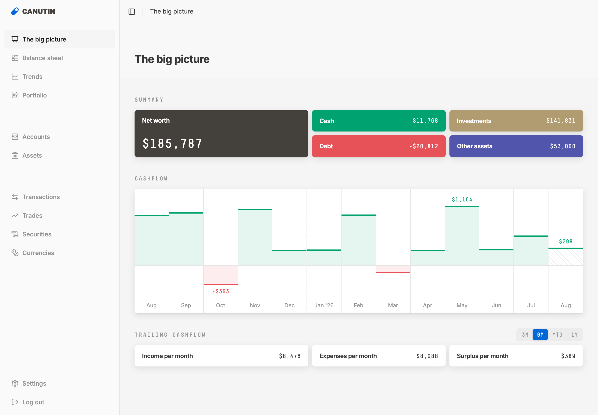

# Canutin

Canutin is a personal finance app you run on your own server. It keeps your accounts, assets, transactions, and investments in one place and shows you the whole picture: net worth, balance sheet, cash flow trends, and portfolio performance, in any mix of currencies.

Try it at [demo.canutin.com](https://demo.canutin.com).



- Track bank accounts, credit cards, loans, property, vehicles, or anything else with a balance.
- Browse, label, and filter every transaction.
- Follow your investments with securities, trades, and portfolio views.
- Hold balances in multiple currencies with automatic exchange rates.
- Sync balances and transactions from your bank through [Plaid](docs/plaid.md), using your own Plaid credentials.
- Let [AI agents](docs/ai-agents.md) import statements, label spending, and answer questions about your data.
- Import data in bulk through the API, and revert any import that went wrong.
- Install it as an app on desktop and mobile.

Your data lives in a single SQLite database on your server and is accessible through a fully documented REST API.

## Self-hosting (Docker)

Create a `docker-compose.yml` file:

```yaml
services:
  pocketbase:
    image: ghcr.io/fmaclen/canutin:latest
    working_dir: /app/pocketbase
    command: ['./pocketbase-custom', 'serve', '--http', '0.0.0.0:42070']
    ports:
      - '42070:42070'
    environment:
      PLAID_CLIENT_ID: ${PLAID_CLIENT_ID:-}
      PLAID_SECRET: ${PLAID_SECRET:-}
      PLAID_ENV: ${PLAID_ENV:-}
    volumes:
      - canutin-data:/app/pocketbase/pb_data
    restart: unless-stopped

  sveltekit:
    image: ghcr.io/fmaclen/canutin:latest
    command: ['node', 'build/index.js']
    ports:
      - '42069:42069'
    environment:
      PUBLIC_PB_URL: ${PUBLIC_PB_URL:-http://localhost:42070}
      PUBLIC_PLAUSIBLE_DOMAIN: ${PUBLIC_PLAUSIBLE_DOMAIN:-}
      PUBLIC_PLAUSIBLE_SCRIPT_URL: ${PUBLIC_PLAUSIBLE_SCRIPT_URL:-}
      ORIGIN: ${ORIGIN:-http://localhost:42069}
    depends_on:
      - pocketbase
    restart: unless-stopped

volumes:
  canutin-data:
```

Then run:

```bash
docker compose up -d
```

Open [http://localhost:42069](http://localhost:42069) to access Canutin.

### Initial setup

On first run, PocketBase needs a superuser to be configured. Get the setup link from the logs:

```bash
docker compose logs pocketbase | grep "pbinstal"
```

Open the URL in your browser to create your superuser account. Once complete, refresh Canutin and sign up for your regular user account.

### Serving behind a domain

The defaults above only work on `localhost`. To serve Canutin at a real domain, put both services behind your reverse proxy and set two variables in a `.env` file next to `docker-compose.yml`:

```dotenv
ORIGIN=https://canutin.example.com
PUBLIC_PB_URL=https://canutin-pb.example.com
```

`ORIGIN` is the URL your users load the app from; without it, form submissions fail cross-origin checks. `PUBLIC_PB_URL` is the URL of the PocketBase service and must be reachable from your users' browsers, not just from inside Docker.

### Updating

Every release publishes a new image to `ghcr.io/fmaclen/canutin:latest`. To update by hand:

```bash
docker compose pull && docker compose up -d
```

Settings shows the version you are running and tells you when a newer one is available, so nothing checks for updates unless you open that page.

To update automatically instead, add [Watchtower](https://containrrr.dev/watchtower/) to your `docker-compose.yml`, and label the two services it should watch so the rest of the host is left alone:

```yaml
services:
  pocketbase:
    labels:
      com.centurylinklabs.watchtower.enable: 'true'
    # ...rest of the service

  sveltekit:
    labels:
      com.centurylinklabs.watchtower.enable: 'true'
    # ...rest of the service

  watchtower:
    image: containrrr/watchtower:1.7.1
    command: ['--cleanup', '--label-enable', '--interval', '86400']
    volumes:
      - /var/run/docker.sock:/var/run/docker.sock
    restart: unless-stopped
```

Watchtower checks once a day and recreates a container when its image changes.

Updates apply database migrations on start, so take a copy of the `canutin-data` volume if you want to be able to roll back.

### Bank syncing

To sync balances and transactions from your bank, add your Plaid credentials to the same `.env` file. See the [Plaid guide](docs/plaid.md).

### Analytics

Plausible analytics is disabled by default. To enable it, add the site domain and script URL from your Plausible installation to the same `.env` file:

```dotenv
PUBLIC_PLAUSIBLE_DOMAIN=canutin.example.com
PUBLIC_PLAUSIBLE_SCRIPT_URL=https://plausible.example.com/js/script.js
```

## Documentation

- [Migrating from Canutin v1](docs/migrating-from-v1.md)
- [Syncing banks with Plaid](docs/plaid.md)
- [Using AI agents with Canutin](docs/ai-agents.md)

## Development

Canutin is built with SvelteKit, PocketBase, and Bun. All you need to start is [Bun](https://bun.sh) installed, then run:

```bash
bun install && bunx playwright install && bun run test
```

| Command             | Description                                                                     |
| ------------------- | ------------------------------------------------------------------------------- |
| `bun run dev`       | Start Vite dev server                                                           |
| `bun run build`     | Production build via Vite/SvelteKit                                             |
| `bun run preview`   | Preview the built app                                                           |
| `bun run check`     | Type-check with svelte-check                                                    |
| `bun run lint`      | Prettier check + ESLint                                                         |
| `bun run verify`    | Non-mutating gate: lint, type-check, and build                                  |
| `bun run format`    | Auto-format with Prettier (writes files)                                        |
| `bun run quality`   | Format, lint, and type-check (writes files via format)                          |
| `bun run test`      | Run Playwright e2e tests                                                        |
| `bun run pb`        | Ensure and start PocketBase locally (dev)                                       |
| `bun run pb:import` | Import a Canutin v1 vault, see the [migration guide](docs/migrating-from-v1.md) |
| `bun run pb:reset`  | Reset (delete) the PocketBase dev database                                      |

## License

Canutin is open source under the [Apache 2.0 license](LICENSE).
