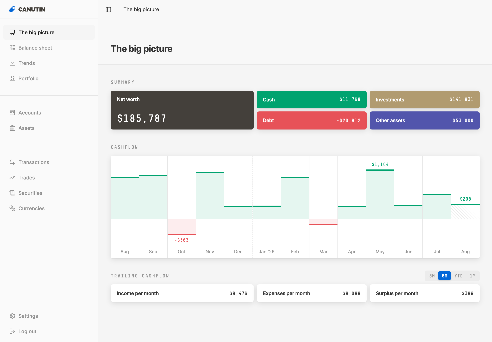

# Canutin

Canutin is a personal finance app you run on your own server. It keeps your accounts, assets, transactions, and investments in one place and shows you the whole picture: net worth, balance sheet, cash flow trends, and portfolio performance, in any mix of currencies.

Try it at [demo.canutin.com](https://demo.canutin.com).



- Track bank accounts, credit cards, loans, property, vehicles, or anything else with a balance.
- Browse, label, and filter every transaction.
- Follow your investments with securities, trades, and portfolio views.
- Hold balances in multiple currencies with automatic exchange rates.
- Sync balances and transactions from your bank through [Plaid](docs/plaid.md), using your own Plaid credentials.
- Let [AI agents](docs/ai-agents.md) import statements, label spending, and answer questions about your data.
- Import data in bulk through the API, and revert any import that went wrong.
- Install it as an app on desktop and mobile.

Your data lives in a single SQLite database on your server and is accessible through a fully documented REST API.

## Self-hosting (Docker)

Create a `docker-compose.yml` file:

```yaml
services:
  pocketbase:
    image: ghcr.io/fmaclen/canutin:latest
    ports:
      - '42070:42070'
    environment:
      PLAID_CLIENT_ID: ${PLAID_CLIENT_ID:-}
      PLAID_SECRET: ${PLAID_SECRET:-}
      PLAID_ENV: ${PLAID_ENV:-}
      PUBLIC_PLAUSIBLE_DOMAIN: ${PUBLIC_PLAUSIBLE_DOMAIN:-}
      PUBLIC_PLAUSIBLE_SCRIPT_URL: ${PUBLIC_PLAUSIBLE_SCRIPT_URL:-}
    volumes:
      - canutin-data:/app/pocketbase/pb_data
    restart: unless-stopped

volumes:
  canutin-data:
```

For optional Plaid or analytics settings, create a `.env` file next to `docker-compose.yml`. The sections below list the values to put there.

Then run:

```bash
docker compose up -d
```

Open [http://localhost:42070](http://localhost:42070) to access Canutin. PocketBase serves the app, API, realtime updates, and admin UI from this one address.

### Initial setup

On first run, PocketBase needs a superuser to be configured. Get the setup link from the logs:

```bash
docker compose logs pocketbase | grep "pbinstal"
```

Open the URL in your browser to create your superuser account. Once complete, create your regular user account in the admin UI at `/_/`, then refresh Canutin and log in. Public sign-ups are closed by default.

The admin UI and app share a browser storage origin. Open superuser sessions in a separate browser profile or private session, especially when the app loads third-party analytics scripts.

### Serving behind a domain

Point your reverse proxy at port `42070` and serve the whole application from one domain, such as `https://canutin.example.com`. Forward every path, including `/api/` and `/_/`, and allow long-lived connections for realtime updates. Terminate HTTPS at the proxy. The frontend uses the same origin automatically.

### Migrating an existing two-service deployment

This change requires a breaking release and a coordinated cutover for existing hosts. Pause automatic updates or pin the current image until the proxy and Compose changes are ready.

Back up your `canutin-data` volume before updating. Keep the existing Compose project name and the `canutin-data:/app/pocketbase/pb_data` mount so the new container uses the same database.

Replace the old Compose services with the single `pocketbase` service above. Move any `PUBLIC_DEMO_ENABLED` and `PUBLIC_PLAUSIBLE_*` settings onto that service. Remove `PUBLIC_PB_URL`, `ORIGIN`, and the frontend `PORT` setting. Point the app domain's reverse proxy at PocketBase on port `42070`, replacing its old `42069` upstream. External import clients should use the app domain too.

Before cutover, copy any Cloudflare Access policies or reverse-proxy restrictions protecting the old backend's admin paths to the app origin. Cover both `/_` and `/_/` and retain any API restrictions the deployment uses. Verify those protections before directing the app domain to PocketBase.

Run `docker compose pull` followed by `docker compose up -d --remove-orphans` to recreate PocketBase and remove the old `sveltekit` container. Keep the data volume. If port `42069` must remain the public host port, use `42069:42070` in the port mapping and keep that proxy upstream port.

### Updating

Every release publishes a new image to `ghcr.io/fmaclen/canutin:latest`. To update by hand:

```bash
docker compose pull && docker compose up -d
```

Settings shows the version you are running and tells you when a newer one is available, so nothing checks for updates unless you open that page.

To update automatically instead, add [Watchtower](https://watchtower.nickfedor.com/) to your `docker-compose.yml`, and label the Canutin service it should watch so the rest of the host is left alone:

```yaml
services:
  pocketbase:
    labels:
      com.centurylinklabs.watchtower.enable: 'true'
    # ...rest of the service

  watchtower:
    image: nickfedor/watchtower:1.21.2
    command: ['--cleanup', '--label-enable', '--interval', '86400']
    volumes:
      - /var/run/docker.sock:/var/run/docker.sock
    restart: unless-stopped
```

This actively maintained Watchtower fork supports Docker Engine 29 through Docker API version negotiation. It checks once a day and recreates a container when its image changes. The original [Containrrr project](https://github.com/containrrr/watchtower) is archived.

Updates apply database migrations on start, so take a copy of the `canutin-data` volume if you want to be able to roll back.

### Bank syncing

To sync balances and transactions from your bank, add your Plaid credentials to the same `.env` file. See the [Plaid guide](docs/plaid.md).

### Analytics

Plausible analytics is disabled by default. To enable it, add the site domain and script URL from your Plausible installation to the same `.env` file:

```dotenv
PUBLIC_PLAUSIBLE_DOMAIN=canutin.example.com
PUBLIC_PLAUSIBLE_SCRIPT_URL=https://plausible.example.com/js/script.js
```

## Documentation

- [Migrating from Canutin v1](docs/migrating-from-v1.md)
- [Syncing banks with Plaid](docs/plaid.md)
- [Using AI agents with Canutin](docs/ai-agents.md)

## Development

Canutin is built with SvelteKit, PocketBase, and Bun. Install [Bun](https://bun.sh) and [Go](https://go.dev/dl/), then run:

```bash
bun install && bunx playwright install && bun run test
```

| Command             | Description                                                                     |
| ------------------- | ------------------------------------------------------------------------------- |
| `bun run dev`       | Start PocketBase and Vite with a same-origin API proxy                          |
| `bun run build`     | Build the static app into `build/`                                              |
| `bun run preview`   | Serve the built app through PocketBase                                          |
| `bun run check`     | Type-check with svelte-check                                                    |
| `bun run lint`      | Prettier check + ESLint                                                         |
| `bun run verify`    | Non-mutating gate: lint, type-check, and build                                  |
| `bun run format`    | Auto-format with Prettier (writes files)                                        |
| `bun run quality`   | Format, lint, and type-check (writes files via format)                          |
| `bun run test`      | Build the app and run Playwright against PocketBase                             |
| `bun run pb`        | Ensure and start PocketBase locally (dev)                                       |
| `bun run pb:import` | Import a Canutin v1 vault, see the [migration guide](docs/migrating-from-v1.md) |
| `bun run pb:reset`  | Reset (delete) the PocketBase dev database                                      |

For local development, run `bun run dev`. For the production serving path, run `bun run build` and then `bun run preview`. Worktrees use the ports in their generated `.env`.

## License

Canutin is open source under the [Apache 2.0 license](LICENSE).
